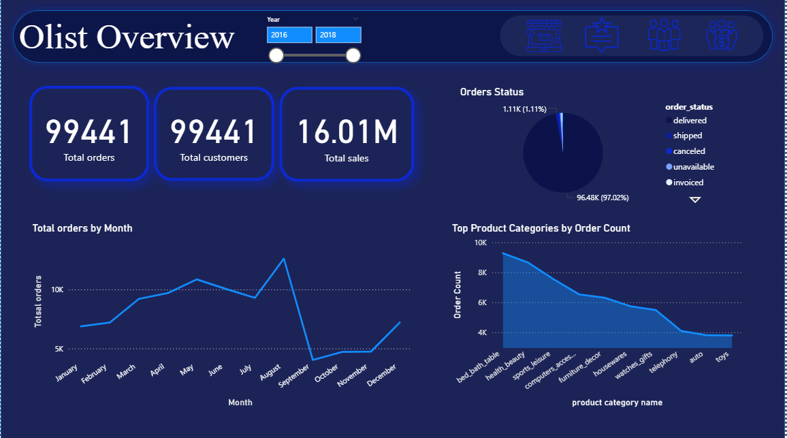

# Brazilian E-Commerce Dashboard 📊

This Power BI dashboard provides a comprehensive analysis of the Brazilian e-commerce market using data from **Olist**. It offers insights into orders, sales performance, customer behavior, product reviews, and seller activity. It serves as a valuable tool for business analysts, marketing teams, and decision-makers.

---
## 🖼️ Dashboard Snapshots

  
  
  

---

## 📌 Dashboard Overview

| Metric             | Value              |
|--------------------|--------------------|
| **Total Orders**    | 99,441             |
| **Total Customers** | 99,441             |
| **Total Sales**     | 16.01 million BRL  |

---

## 📦 1. Order Analysis

- **📈 Order Trends by Month**  
  Line chart showing monthly order volume from 2016 to 2018, helping identify seasonal trends and growth over time.

- **📦 Order Status Breakdown**  
  Visual representation of order statuses such as:
  - Delivered
  - Shipped
  - Canceled
  - In Transit

---

## 🛍️ 2. Product Insights

- **🏆 Top Product Categories by Order Count**  
  Bar chart displaying the most popular categories:
  - bed_bath_table
  - health_beauty
  - sports_leisure  
  Useful to identify consumer preferences.

---

## 👥 3. Customer Analysis

- **🌍 Customer Distribution by City**  
  Map and bar charts showing customer locations, with top cities including:
  - São Paulo
  - Rio de Janeiro
  - Belo Horizonte

- **💳 Payment Method Distribution**  
  Pie chart of payment types:
  - Credit Card
  - Boleto
  - Voucher

---

## ⭐ 4. Review Analysis

- **🗣️ Total Reviews:** 99,224  
- **📊 Review Score Breakdown**  
  Bar chart showing customer ratings (1 to 5 stars) to assess satisfaction levels.

- **☁️ Top Keywords in Reviews**  
  Word cloud highlighting common keywords in customer feedback. Helps identify:
  - Product issues
  - Service praise
  - Sentiment trends

---

## 🧾 5. Seller Performance

- **🏙️ Top Seller Cities**  
  Visualization of cities with the highest seller activity:
  - São Paulo
  - Curitiba
  - Belo Horizonte

- **💰 Sales by Seller City**  
  Bar chart showcasing total sales generated by sellers in different cities.

---

## 📚 Data Source

- The dataset is provided by [Olist](https://www.kaggle.com/datasets/olistbr/brazilian-ecommerce), available on Kaggle.
